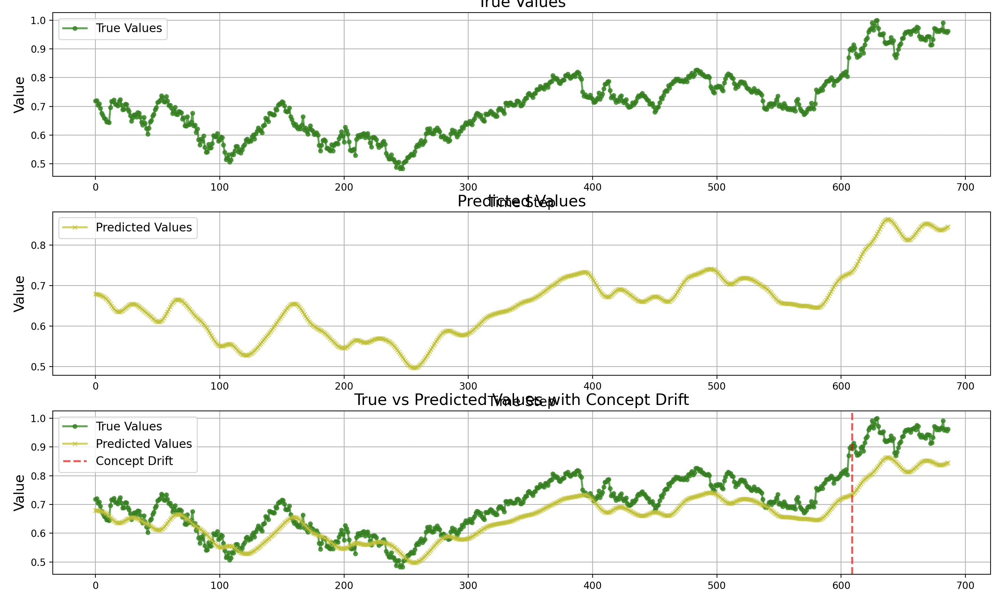
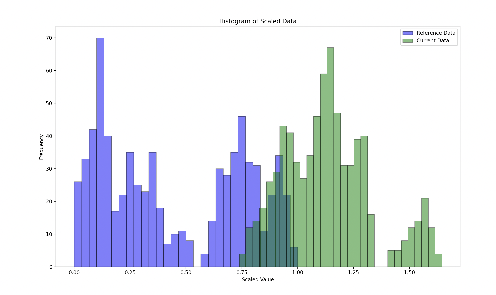
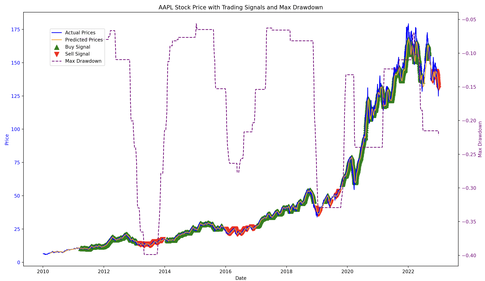
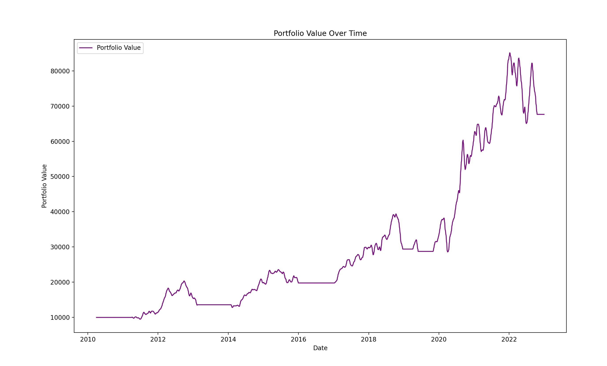

# Stock Data Pipeline with Concept Drift Detection

This project implements a stock data pipeline using yfinance for data fetching, scikit-learn for preprocessing, Keras for building and training an LSTM model, and frouros for concept drift detection. The configuration is managed using hydra and omegaconf.


## Installation

  1. Clone the repository:
       ```bash
        git clone https://github.com/Moctader/concept_drift_detection_using_frouros.git

        cd

  2. Create a virtual environment and activate it
        ```bash
        python3 -m venv venv
        source venv/bin/activate

  3. Install the required packages
        ```bash
        pip install -r requirements.txt


## Workflow

1. **Initialize the Pipeline**:

    - Create an instance of `StockDataPipeline` with the specified stock symbol, split ratio, and sequence length.
    - Fetch and preprocess the stock data.
    - Build the LSTM model using the specified layers.
    - Train the model on the historical data.

2. **Initialize the Drift Detector**:

    - Create an instance of `ConceptDriftDetector` with the specified parameters.

3. **Run the Stream Processor**:

    - Create an instance of `StreamProcessor` with the pipeline and detector.
    - Run the stream test for concept drift detection on the current data.
    - Detect target drift using the `detect_target_drift` method.

4. **Plot the Results**:

    - Plot the true values, predicted values, and concept drift point using the `plot_results` function.

    
    


## Trading 

The `Trading_strategy.py` script fetches historical stock data, preprocesses it, trains an LSTM model to predict future prices, generates trading signals based on performance metrics, simulates a trading strategy, and visualizes the results. It also includes additional analysis for higher predictions and sell/buyback opportunities, and uses statistical methods to make informed trading decisions.

## Features

- Fetches historical stock data for Apple Inc. (AAPL) from Yahoo Finance.
- Preprocesses and scales the data.
- Creates datasets suitable for LSTM model training.
- Trains an LSTM model to predict future stock prices.
- Generates buy and sell signals based on performance metrics.
- Simulates a trading strategy based on the generated signals.
- Visualizes actual and predicted stock prices, trading signals, and portfolio value.
- Analyzes higher predictions and sell/buyback opportunities.






### Outputs
Number of predictions higher than the current value: 264

---

Average percentage growth for higher predictions: 2.84%

---

Sell opportunities found: 288

---

Average potential gain from sell opportunities: -0.61

---

Shares to buy: 50

---

Current price is not high enough to justify a sell.

---

Shares to sell: 0